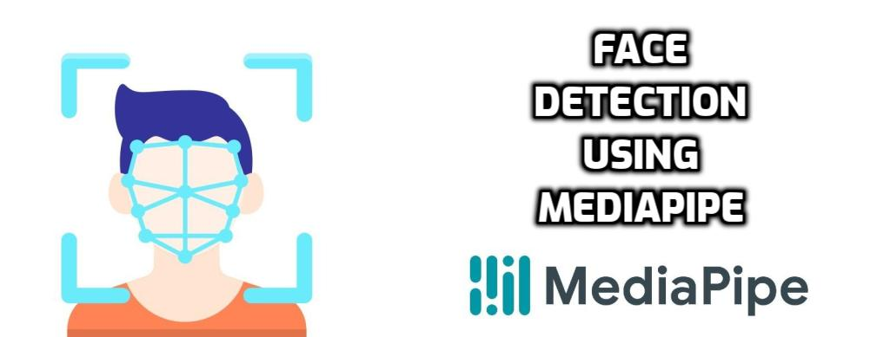

<!-- PROJECT TITLE -->
<h1 align="center">Face Detection Using Mediapipe</h1>

<!-- HEADER -->
<p align="center">
  
</p>

<!-- PROJECT DESCRIPTION -->
## <br>**➲ Project description**
Face detection implementation using mediapipe library on python, where we can implement this solution
on an image, a video or web cam where medipipe detect face bounding box and then we can draw it using opencv.

<!-- PREREQUISTIES -->
## <br>**➲ Prerequisites**
This is list of required packages and modules for the project to be installed :
* <a href="https://www.python.org/downloads/" target="_blank">Python 3.x</a>
* OpenCV 
* Mediapipe 

<!-- INSTALLATION -->
## <br>**➲ Installation**
1. Clone the repo
   ```sh
   git clone https://github.com/omaarelsherif/Face-Detection-Using-Mediapipe.git
   ```
2. Run the code from cmd
   ```sh
   python face_detection_mediapipe.py "FLAG" "IMAGE_PATH"/"VIDEO_PATH"
   ```
   For Image:
   ```sh
   python face_detection_mediapipe.py img Images/img1.jpg
   ```
   For Video:
   ```sh
   python face_detection_mediapipe.py vid Videos/video.mp4
   ```
   For Cam:
   ```sh
   python face_detection_mediapipe.py cam
   ```

<!-- OUTPUT -->
## <br>**➲ Output**
Here's the project output where the input is an image containing single or multi faces or a video and the output will be the same image with bounding boxs around all faces or a video with bounding box on faces in every frame as follows:

<h3>Face Detection Image Output - Single face</h3>


<h3>Face Detection Image Output - Multi faces</h3>


<h3>Face Detection Video Output</h3>


<!-- REFERENCES -->
## <br>**➲ References**
These links may help you to better understanding of the project idea and techniques used :
1. Mediapipe : https://bit.ly/3AlHJ6f
   
<!-- CONTACT -->
## <br>**➲ Contact**
- E-mail   : [omaarelsherif@gmail.com](mailto:omaarelsherif@gmail.com)
- LinkedIn : https://www.linkedin.com/in/omaarelsherif/
- Facebook : https://www.facebook.com/omaarelshereif
